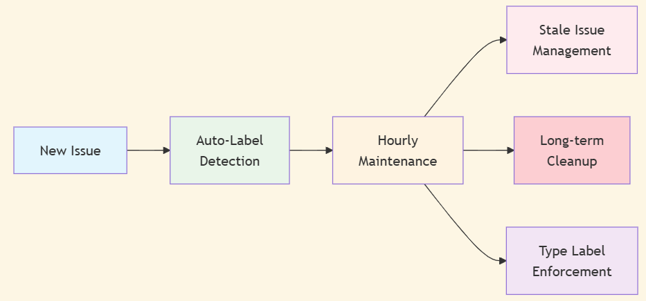

# GitOps Resource Management Workflow Diagram

This diagram shows the flow of the `resourceManagement.yml` GitOps configuration for automated issue management and triage.

## Simplified Overview

## Configuration Summary

### Event Responders (Triggered on Issue Events):

1. **Auto-Type Detection**:
   - Detects "Type: Bug" in issue body → adds `Type:Bug` label
   - Detects "Type: Feature Request" in issue body → adds `Type:Feature` label

2. **Type Label Enforcement**:
   - Issues without type labels → adds comment requesting team to add type + `needs-typeLabel`
   - When type label is added → removes `needs-typeLabel`

### Scheduled Tasks (Run Hourly):

1. **Stale Issue Management**:
   - Issues with `needs-info` + 7 days inactive + `Stale` → **Close**
   - Issues with `needs-info` + 7 days inactive (no `Stale`) → **Warn + Add Stale label**

2. **Long-term Cleanup**:
   - Non-feature, low-priority issues inactive for 18+ months → **Auto-close**

3. **Type Label Maintenance**:
   - Issues missing type labels → **Add `needs-typeLabel` + comment**

### Safety Features:
- `DoNotClose` label prevents auto-closure
- Only affects issues without existing type labels
- Preserves high-priority issues (`Priority:0`, `Priority:1`)
- Maintains feature requests regardless of age
